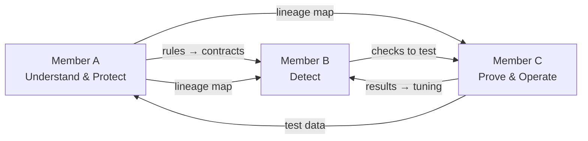

# Telemetry Pipeline Hardening: Team Split (3 members)

> C5i capstone brief **#31**. Demo call: **8 Oct**. Timelines deliberately left out for now.
> Related docs: `docs/REQUIREMENTS_AND_OPEN_QUESTIONS.md` · `docs/BUILD_PLAN.md` · `docs/SYSTEM_DIAGRAMS.md` · `docs/ARCHITECTURE.md`
> **Why the split matters:** the panel scores **each person individually**. Every member owns one area, presents it, and must be able to answer questions on the whole design.

---

## 1. The project in 5 lines
1. We get a data pipeline that someone else wrote.
2. We **understand** it and **pin** how it behaves today with tests.
3. We add **checks** that catch bad data quietly getting in.
4. We **break the data on purpose** to prove the checks work, and measure them against baselines.
5. We **deploy, secure and demo** it.

---

## 2. Roles

### Member A: Understand & Protect
**Job:** understand the unfamiliar pipeline and make sure we never break it.
- Receive the pipeline and freeze it (tagged, read-only)
- Build the **code graph**: which function uses which field, and how fields flow to outputs
- Write down the **hidden rules** the pipeline relies on (`GUARANTEES.md`), each with an evidence line
- Write **characterisation tests**: save today's output so any change is visible
- Add the small **hook lines** into the pipeline, and prove nothing else changed (blast radius)
- Prove the **output is equivalent** before and after our changes
- Provide the **lineage map** (source → field → stage → output) used by alerts
- **Reports:** characterisation-test coverage · output equivalence · lineage completeness
- **Watch out for:** the agent explaining code wrongly with confidence · the agent "fixing" legacy bugs · flaky tests (time, randomness, row order) · field names that only appear at runtime

### Member B: Detect
**Job:** build the checks that catch bad data.
- Write the **contracts** (rules per checkpoint) from A's guarantees
- Build the **quality gates**: missing fields, nulls, wrong type, out-of-range, unit change, volume drop
- Build **numeric drift** detection
- Build **text payload drift** detection
- Build the **alert manager**: one alert per problem, naming the source (e.g. "Android v5.2")
- **Reports:** detection precision · detection recall
- **Watch out for:** a fault hidden in the overall average (always check per source/version) · false alarms from too many checks · legitimate changes (new version, new optional field) · many forms of "missing" (`null`, `""`, `"N/A"`) · tiny batches · alert storms · checks that change the data while "only watching"

### Member C: Prove & Operate
**Job:** break the data on purpose, measure results, and make it usable and deployable.
- Build the **synthetic data generator** in the format the chosen open-source pipeline expects
- **Lead the pipeline selection** using BRD §8a (README and licence only; nobody reads the code before it is frozen)
- Build the **fault injector** and record the ground truth
- Run the **evaluation** against baselines: B0 no checks · B1 simple checks · our system
- Build the **CI evaluation gate** (a bad merge is blocked, and we demonstrate it)
- Build the **API + React dashboard**
- **Deployment**: non-production target, health checks, rollback, runbook
- **Reports:** detection lag · the full evaluation scorecard
- **Watch out for:** tuning thresholds on the final evaluation data (keep separate sets) · an unclear "alert matches fault" rule · hiding undetectable faults (report them) · non-reproducible runs (fix seeds) · duplicate results on reruns

---

## 3. Shared work (one lead, everyone contributes)
| Task | Lead | Everyone's part |
|---|---|---|
| Repo setup, `CLAUDE.md`, hooks, skills, agent permission boundary | A | Follow the same standards |
| BRD with testable acceptance criteria, ADRs, task plan | All | Each writes their own section |
| Security scan, triage, secrets handling | B | Fix findings in their own code |
| Review log (what the agent produced, what we rejected, defects caught) | All | Log their own agent work |
| Evaluation report, deck (5–6 slides), one-page summary, demo + backup video | C | Each presents their own part |

---

## 4. How the work connects
| From | To | What is handed over |
|---|---|---|
| A | B | Hidden rules → contracts |
| A | B, C | Lineage map → alerts and dashboard |
| B | C | Checks → tested with injected faults |
| C | B | Evaluation results → threshold tuning |
| C | A | Synthetic test data → characterisation tests |

### Shared agreements (fixed early; changes need all three to agree)
Defined in code under `teleguard/models.py` and `db/init/001_schema.sql`:
- The hook: `guard.check(checkpoint, df) -> df` and guard modes `off | observe | enforce`
- `CheckResult` and `Alert` formats
- The pipeline adapter interface (`teleguard/adapters/base.py`)
- Code-graph node/edge types (`teleguard/codegraph/model.py`)
- Postgres tables
- The event envelope fields: `source_id`, `client_version`, `batch_id`, `event_ts`, `ingest_ts`

---

## 5. Order of work
1. **Everyone:** repo setup and the BRD (can start now)
2. **A** understands the pipeline and writes tests, while **C** builds the data generator and fault injector
3. **B** builds the checks using A's rules
4. **C** runs the evaluation, **B** tunes the checks, and **A** proves the output hasn't changed
5. **C** builds the dashboard and deployment; **B** runs security
6. **Everyone:** evidence pack, deck, rehearsal, demo on 8 Oct

---

## 6. Ways of working
- One Git repo; one branch per member; pull request into `main`, reviewed by **one other member**
- Claude Code is the primary build tool; it follows `CLAUDE.md`, and every agent change is reviewed and logged
- The pipeline code is protected: only declared hook lines may change (CI + hooks enforce this)
- Each member writes the tests for their own module

---

## 7. Demo on the panel's structure (15 min + 5 min Q&A)
| Time | Segment | Who |
|---|---|---|
| 2 min | Problem & business case | C |
| 2 min | Solution design, BRD, decisions taken and rejected | A |
| 2 min | How the agent was used and controlled | B |
| 5 min | Live demo: A (pipeline map, guarantees, tests) → B (inject fault live, gate and drift catch it, alert with lineage) → C (full evaluation run, scorecard, blocked merge) | All |
| 3 min | Evidence: review log, evaluation vs baseline, security, deployment + rollback | C (with B for security) |
| 1 min | Limitations & next steps | A |
| 5 min | Q&A: each member answers on their own area | All |

---

## 8. Success metrics: who reports what
| Metric | Owner | Target |
|---|---|---|
| Characterisation-test coverage | A | To be set in the BRD (⏳Q7, Q16) |
| Output equivalence | A | To be set in the BRD (⏳Q8) |
| Lineage completeness | A | To be set in the BRD (⏳Q9) |
| Detection precision | B | To be set in the BRD (⏳Q6, Q16) |
| Detection recall | B | To be set in the BRD (⏳Q6, Q16) |
| Detection lag | C | To be set in the BRD (⏳Q6) |
| Baseline comparison | C | B0 + B1 unless the panel says otherwise (⏳Q4) |

---

## 9. Still open
- ✅ **Q1/Q2 decided:** an open-source pipeline (BRD §8a). ✅ **Q17 decided:** Python + SQL support.
- ✅ Checks run per batch on arrival (event-driven). ✅ In-product AI: alert explainer only (BRD FR-12).
- ⏳ Which open-source pipeline. ⏳ Who owns the alert explainer (suggestion: Member B, who owns alerts).
- Member names: fill in who is A, B and C.
