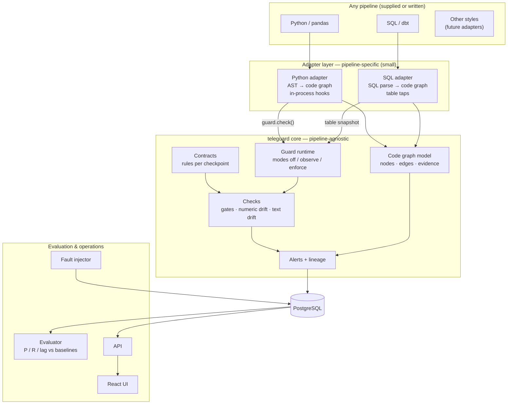

# Architecture: Telemetry Pipeline Hardening

> **Status:** v0.1, skeleton built. Pipeline-agnostic by design, so it works whether or not a pipeline is supplied (Q1/Q2 open).
> Decisions still pending are marked ⏳ with their question/ADR number.

---

## 1. Core idea: separate "what is pipeline-specific" from "what is general"

Only a thin **adapter** knows about a particular pipeline. Everything else works on **data at tap points** and on a **common code-graph format**, so it doesn't care how the pipeline is written.



### Two ways to attach to a pipeline
| Mode | How | Pipeline change | Best for |
|---|---|---|---|
| **In-process hook** | One line per stage boundary: `df = guard.check("after_clean", df, ctx)` | A few declared lines | Python/pandas pipelines |
| **Out-of-process tap** | After a stage writes a table/file, the tap reads it and calls the same guard | **None** | SQL/ELT pipelines, or when we may not touch the code at all |

Both end in the same `Guard` object, so checks, alerts and evaluation are identical either way. Which one we use is decided once we see the pipeline (ADR-1, ⏳Q1).

---

## 2. Components and ownership

| Package / folder | Responsibility | Owner |
|---|---|---|
| `teleguard/models.py` | Shared data contracts: `CheckResult`, `Alert`, `BatchContext`, enums | Shared (A leads) |
| `teleguard/config.py` | Guard mode and settings from environment | Shared |
| `teleguard/guard.py` | Guard runtime: runs checks at a checkpoint, never mutates data, fail-open on internal errors | B |
| `teleguard/checks/` | Check interface + gates, numeric drift, text drift | B |
| `teleguard/contracts/` | Contract files → check configuration | B |
| `teleguard/alerts/` | Grouping, source attribution, severity | B |
| `teleguard/sinks.py` | Where results go (memory for tests, Postgres later) | B / C |
| `teleguard/codegraph/` | Common graph model + queries (upstream/downstream) | A |
| `teleguard/adapters/` | Adapter interface + Python adapter (+ SQL adapter if needed) | A |
| `teleguard/lineage/` | Graph → alert lineage path, completeness score | A |
| `teleguard/inject/` | Fault catalogue + injector + ground truth | C |
| `teleguard/evaluate/` | Matching alerts to injections, metrics, baselines | C |
| `datagen/` | Synthetic telemetry generator (seeded) | C |
| `api/`, `ui/` | FastAPI service, React dashboard | C |
| `pipelines/<name>/` | The pipeline under test (read-only) + its contract | A (freeze), author per ⏳Q2 |
| `db/init/` | Postgres schema | Shared |
| `.claude/`, `CLAUDE.md` | Agent rules, protected-path hook, permissions | Shared (A leads) |
| `.github/workflows/` | CI: lint, types, tests, security, eval gate | C (gate), B (security) |

---

## 3. Key contracts (already in code)

### 3.1 The hook
```text
guard.check(checkpoint: str, df: DataFrame, ctx: BatchContext) -> DataFrame
```
| Mode | Behaviour |
|---|---|
| `off` | Returns the **same object** untouched. No checks run. (Instant kill-switch / rollback level 1) |
| `observe` | Runs checks on a **copy**, records results, returns the original untouched. Check crashes are recorded as `ERROR` results, never raised (fail-open). |
| `enforce` | Same as observe, then applies the **fail policy** if any check returns `FAIL`. The default policy raises `BatchRejectedError`. ⏳ ADR-4 / Q11 decides the final behaviour (block vs quarantine). |

### 3.2 Check interface
A check is any object with a `name` and `run(df, ctx) -> list[CheckResult]`. Checks don't write anywhere and don't modify `df`.

### 3.3 Result and alert formats
- `CheckResult`: run_id, batch_id, checkpoint, check_name, check_type, field, segment, status (`pass/warn/fail/error/insufficient_data`), score, threshold, message, evidence, created_at
- `Alert`: alert_id, root_field, segment, first_batch_id, severity, check refs, lineage path, affected outputs, status

### 3.4 Event envelope (every record must carry these)
`event_id`, `source_id`, `client_version`, `batch_id`, `event_ts`, `ingest_ts`. The adapter or ingest tagging adds them if the pipeline doesn't. They make **segmenting** (per source/version) and **lineage** possible.

### 3.5 Code-graph model
- **Node types:** `module`, `function`, `field`, `output`, `external`, `stage`
- **Edge types:** `imports`, `calls`, `reads`, `writes`, `derives`, `produces`, `next_stage`
- Every edge carries **evidence** (file, line, snippet) and **origin** (`static`, `runtime`, `both`)
- Queries: `downstream(node)`, `upstream(node)`, JSON export for the UI

---

## 4. Data flow
See `docs/SYSTEM_DIAGRAMS.md` §2 (one batch at runtime) and §3 (evaluation & CI gate).

---

## 5. Storage (PostgreSQL)
`db/init/001_schema.sql` creates these tables:

| Table | Holds |
|---|---|
| `pipeline_runs` | One row per run: pipeline, guard mode, git sha, timing |
| `batches` | One row per batch per run, with the source breakdown |
| `check_results` | Every `CheckResult` |
| `alerts` | Grouped alerts with lineage |
| `graph_nodes`, `graph_edges` | The code graph / lineage map |
| `baseline_profiles` | Frozen "normal" statistics per field × segment |
| `injections` | Ground truth of injected faults |
| `eval_runs`, `eval_metrics` | Evaluation results per system (B0, B1, ours) |

Writes are **idempotent**: keyed by `(run_id, batch_id, checkpoint, check_name, field, segment)`, so rerunning a batch doesn't duplicate results.

---

## 6. Blast-radius control
1. The pipeline lives under `pipelines/<name>/legacy/`. It is **protected**:
   - a Claude Code `PreToolUse` hook blocks agent edits to it (`.claude/hooks/protect_paths.py`)
   - Claude Code permissions deny edits there, and deny reading `answer_key/` and `.env`
   - CI will fail if files there change beyond the declared hook lines (to be added with the pipeline)
2. Hook lines are added **by a human**, listed in `pipelines/<name>/HOOKS.md`, and reviewed.
3. `TELEGUARD_MODE=off` returns the pipeline to its original behaviour instantly.

---

## 7. What is built vs pending

| Area | State |
|---|---|
| Repo layout, `CLAUDE.md`, protected-path hook, permissions, CI skeleton | ✅ built |
| Shared models, guard runtime (off/observe/enforce), check interface, memory sink | ✅ built + tested |
| Code-graph model + queries | ✅ built + tested |
| Adapter interface | ✅ defined |
| Postgres schema, docker-compose | ✅ written |
| Python adapter (AST → graph), SQL adapter | ⏳ after we see the pipeline (Q1) |
| Gates, numeric drift, text drift, alert grouping | ⏳ next (B) |
| Data generator, fault injector, evaluator | ⏳ next (C); domain ⏳ ADR-2 |
| API, UI, deployment | ⏳ later (C) |

---

## 8. Technology
Python ≥ 3.10 · pandas · pydantic v2 · networkx · PostgreSQL 16 · FastAPI · React + TypeScript (Vite) · pytest · ruff · mypy · Docker Compose · GitHub Actions ⏳Q19
