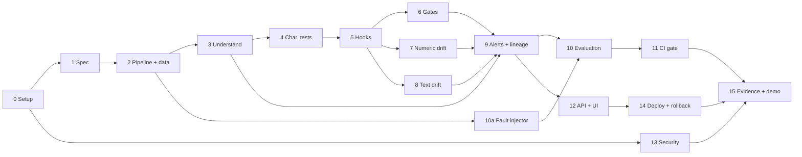

# Telemetry Pipeline Hardening: Build Plan, Edge Cases & Key Decisions

> **Status:** DRAFT for team discussion. No timelines (set aside by the team). Demo call: 8 Oct.
> **Depends on:** open questions in `REQUIREMENTS_AND_OPEN_QUESTIONS.md`. Where a step depends on an unanswered question, it is tagged, e.g. ⏳Q1.
> Owners are **TBD** until the team split is redone.

---

## 1. Guiding principles
1. **Understand before touching.** No change to the pipeline until characterisation tests are green.
2. **The pipeline is read-only**, except for the hook lines we declare. Everything else lives outside it.
3. **Checks are deterministic.** No LLM decides pass or fail, so the metrics are reproducible.
4. **Observe first, enforce later.** Every check runs in shadow mode before it is allowed to block data.
5. **Tune on one dataset, report on another.** Thresholds are never tuned on the evaluation set.
6. **The agent types; we own it.** Every agent change is reviewed and logged. The agent is never trusted about the unfamiliar code without evidence.
7. **Be honest.** Faults we can't detect are reported, not hidden.

---

## 2. Build phases (in dependency order)

Each phase has a goal, the steps, what it produces, and **exit criteria** (these become the BRD's acceptance criteria).

### Phase 0: Repository & agent-engineering setup
**Goal:** the project is "engineered, not prompted" from the first commit.
- Repo structure, `README` skeleton, `.gitignore`, `.env.example`
- `CLAUDE.md`: standards the agent reads every run (style, typing, tests required, forbidden paths)
- **Agent permission boundary**: the agent may **not** edit the pipeline except the hook lines, and may **not** read the sealed answer key (enforced with Claude Code permissions/hooks)
- Hooks: e.g. block edits to protected paths, run lint/tests before commit
- Skills: repeatable tasks ("add a new check", "add a fault type", "record a review")
- CI skeleton: lint + type-check + tests + security scan
- Review-log template (what the agent produced, what we rejected, the defects caught)
- **Exit:** clean clone → one command → tests run in CI; a protected-path edit is blocked by the hook.

### Phase 1: Specification pack
**Goal:** requirements written and testable before code.
- BRD: problem, users, scope, out of scope, **testable acceptance criteria** per requirement (F1–F11, N1–N9)
- Decision records (ADRs) for the decisions in §4
- Task plan (sequenced, owner per task)
- **Exit:** every acceptance criterion is measurable; the team has reviewed it.

### Phase 2: Obtain & freeze the pipeline, plus synthetic data ⏳Q1 ⏳Q2
**Goal:** a working "someone else's" pipeline and realistic data.
- Receive the supplied pipeline, **or** have the agreed author write it (with a sealed answer key of its true rules and hidden assumptions)
- Synthetic event generator: realistic format, several sources/clients/versions, numeric + text fields, **deterministic with a seed**, volume per ⏳Q22
- Three datasets, kept separate:
  - **Baseline-learning set**: "normal" history
  - **Tuning set**: to set thresholds
  - **Evaluation set**: held out, used only for final numbers
- Freeze: tag the pipeline commit as `legacy-v0`
- **Exit:** the pipeline runs end-to-end on generated data, and the output is saved.

### Phase 3: Understand (code graph + guarantees)
**Goal:** reconstruct what the pipeline really does, from code alone.
- Build the code graph: modules → functions → fields → outputs
- Architecture map and dependency/impact view ("if field X breaks, what is affected?")
- Reconstruct guarantees: units, required fields, keys, ranges, silent drops/fills
- **Verify every agent claim** against the code and a real run. Log where the agent was confidently wrong (valued by the panel).
- Runtime confirmation: run once and record the actual columns in/out per stage; compare with the static graph
- **Exit:** `GUARANTEES.md` with an evidence line per claim; score against the answer key if one exists (⏳Q3).

### Phase 4: Characterisation tests
**Goal:** pin current behaviour **before** any change.
- Golden-master tests: fixed seeded inputs → saved outputs
- Edge-case probes (see §3.2): nulls, empty batch, unknown category, duplicates…
- Record odd behaviour **as it is**. We don't fix pipeline bugs, we document them.
- Coverage report (type per ⏳Q7)
- **Exit:** suite green on `legacy-v0`; coverage number recorded.

### Phase 5: Hook points & blast radius
**Goal:** the smallest possible, declared change to the pipeline.
- Choose checkpoint locations from the code graph (stage boundaries)
- Insert hook lines only; the guard mode flag is `off | observe | enforce` (⏳Q11)
- Declare the allowed paths; a CI check fails if anything else in the pipeline changes (⏳Q13)
- **Exit:** with guard `off` and `observe`, the characterisation tests are still green (first equivalence proof).

### Phase 6: Contracts & quality gates
**Goal:** checks that can stop bad batches.
- Contract per checkpoint (from the Phase 3 guarantees): schema, types, required, nullability, ranges, allowed values, units, expected volume
- Checks: schema/type · null-rate · range · unit sanity · volume/freshness · cardinality · payload key-set
- All checks **segmented** by source × client version (the brief's faults are often limited to one version)
- Result per check: pass / warn / fail, with evidence
- **Exit:** each check catches its target fault on the tuning set and raises 0 alerts on clean tuning data.

### Phase 7: Numeric drift
**Goal:** catch distribution and unit shifts that rule-based checks miss.
- Build the baseline profile per field × segment
- Sudden-shift detectors and slow-drift detectors (method choice → ADR)
- Handle small segments, seasonality and many-tests false alarms (see §3.4)
- **Exit:** detects the sudden and gradual numeric faults on the tuning set within the target lag.

### Phase 8: Text payload drift ⏳Q12
**Goal:** catch changes in free text and JSON structure.
- Structure: JSON key set, nesting, lengths
- Content: message templates (mask numbers/IDs first), new or vanished templates, vocabulary shift, language
- Optional semantic layer (embeddings), decided in an ADR (⏳Q14)
- **Exit:** detects the text faults on the tuning set with no alerts on clean data.

### Phase 9: Alerting with lineage ⏳Q9
**Goal:** one clear alert per problem, traced back to the source.
- Group raw check failures into one alert (dedupe, root cause vs downstream symptoms)
- Attribute to the responsible segment (client/version/source)
- Lineage path: source → field → stage → affected outputs (from the code graph)
- Severity, and where alerts go (DB, UI, optional webhook)
- **Exit:** each injected fault produces one alert naming the right source and the affected outputs.

### Phase 10: Fault injection & evaluation
**Goal:** the numbers the panel will judge.
- Fault catalogue (⏳Q5): unit change · version stops emitting · new nullable · type change · gradual drift · text changes · volume drop · **clean runs**
- Each injection is recorded as ground truth (what, where, when)
- Matching rule: when does an alert "count" for an injection? (→ ADR)
- Run the **baselines** (B0 no checks, B1 simple checks; ⏳Q4) and our system on the **same evaluation set**
- Report: detection matrix (fault × check), precision, recall, lag, lineage completeness, equivalence, coverage
- **Exit:** a reproducible report; the same seed gives the same numbers.

### Phase 11: CI evaluation gate
**Goal:** a merge is blocked if quality regresses.
- CI runs the evaluation on a fixed small set; fails if recall/precision drop below thresholds, equivalence breaks, or the pipeline diff leaves the blast radius
- **Demonstrate a blocked merge** (e.g. a pull request that weakens a check)
- **Exit:** a recorded blocked pull request.

### Phase 12: API & dashboard
**Goal:** make results visible and demo-able.
- API over Postgres: runs, check results, alerts, lineage, evaluation
- React UI: pipeline map · checks timeline · drift charts · alerts with lineage · evaluation scorecard
- Real loading, empty and error states
- **Exit:** a live demo path works from a clean clone.

### Phase 13: Security
- Dependency + code scanning; triage every finding (fix or risk-accept, with a written reason)
- Secrets in a manager (⏳Q20), never in the repo or the agent's context
- Written agent permission boundary (from Phase 0)
- **Exit:** scan output + triage document.

### Phase 14: Deployment & operations ⏳Q18
- Non-production deployment, health checks (API, DB, pipeline heartbeat)
- **Demonstrated rollback** (previous version image + guard flag `off` as an instant kill-switch)
- Runbook: how to run, what each alert means, how to roll back, how to add a check
- **Exit:** rollback demonstrated and recorded.

### Phase 15: Evidence pack & demo
- Evaluation report, review log, security and deployment evidence, one-page summary, 5–6 slide deck
- Rehearse the 15-minute run; **record a fallback video**
- **Exit:** every pre-pitch deliverable is submitted.

### Dependency view

Phases 6, 7, 8, 10a, 12 and 13 can run **in parallel**, which is a natural way to split the work between members.

---

## 3. Edge cases & important aspects

### 3.1 Understanding the pipeline (code graph)
| Edge case | Why it's a problem | How we handle it |
|---|---|---|
| Column names built dynamically (`f"{x}_ms"`) or read from config | Code-reading can't see them | Runtime confirmation run; parse config files |
| SQL inside strings | Not visible to a Python parser | Parse the SQL separately |
| Dead code / branches the sample data never reaches | The graph shows paths that never run | Mark edges static / runtime / both |
| Hidden side effects (writes files, calls APIs, global state) | Tests and equivalence break | Record in guarantees; isolate in tests |
| **The agent confidently explains code wrongly** | Wrong guarantees become wrong checks | Every claim needs an evidence line and must be confirmed by a run; log the misses |
| **The agent "fixes" legacy bugs while working** | Breaks equivalence and the blast radius | Protected-path hook; review log |

### 3.2 Characterisation tests
| Edge case | How we handle it |
|---|---|
| **Non-determinism**: current time, random values, UUIDs, dictionary/set order | Freeze time, fix seeds, sort outputs before comparing |
| Floating-point order (sums differ in the last digit) | Stated tolerance (⏳Q8) |
| Row order changes | Compare on sorted keys |
| Timezone / locale / daylight saving | Fix TZ in tests; include DST-crossing data |
| Behaviour that looks like a bug | **Pin it anyway**, and document it as a known issue |
| Empty input, single row, all-null column | Include as probe cases |

### 3.3 Quality gates
| Edge case | Why it matters | How we handle it |
|---|---|---|
| Null vs `NaN` vs `""` vs `"null"` vs `"N/A"` | Different "missing" values slip past null checks | Normalise before measuring; count each kind |
| **Legitimate change**: a new field is added, a new client version is released | Must not raise a false alarm | New optional field → warn, not fail; new version → "no baseline yet" state |
| Tiny batches or tiny segments | Rates are unreliable at small counts | Minimum-sample rule; report "insufficient data" |
| Empty batch | Is it an outage or just a quiet period? | Volume check against the expected rate |
| Duplicate events / replays | Inflate counts | Duplicate-rate check on event id |
| Late or out-of-order events | Wrong window | Event time vs ingest time; define a lateness allowance |
| Timestamps in seconds vs milliseconds | Silent unit change on time itself | Unit check on timestamp magnitude |
| Mixed types in one column (`"123"` and `123`) | Type checks may pass on coercion | Check raw types before coercion |
| **The guard itself crashes or the DB is down** | Could take the pipeline down | Decide **fail-open vs fail-closed** (ADR); default in observe mode = fail-open + alert |
| Guard slows the pipeline | Throughput is an operational concern | Measure overhead; sample if needed |
| **Observe mode accidentally changes the data** (pandas view vs copy, in-place ops) | Breaks equivalence silently | Guard never mutates input; test for it |

### 3.4 Numeric drift
| Edge case | How we handle it |
|---|---|
| Normal daily/weekly patterns (night traffic is lower) | Compare like with like (same hour/day), or a seasonal baseline |
| **Many tests at once** (fields × segments × checks) → false alarms by chance | Adjust thresholds for the number of tests; require persistence (e.g. 2 consecutive batches) |
| Fault only in one client version, **hidden in the overall average** | Segment-level checks (the key point of this brief) |
| **Baseline poisoning**: slow drift gets absorbed into a rolling baseline | Freeze the reference baseline; update only on approval |
| Heavy tails, outliers, lots of zeros | Robust statistics (median/percentiles), zero-rate as its own metric |
| Gradual drift (+1% per day) | A slow-drift detector alongside the sudden-shift one |
| Legitimate business change (a real improvement) | Can't be told apart from data alone; alert with context, humans decide, baseline re-approved |

### 3.5 Text payload drift
| Edge case | How we handle it |
|---|---|
| IDs, numbers, timestamps inside messages make every message "unique" | Mask them before template mining |
| New legitimate messages after a release | Treat as warn plus "new template" review, not fail |
| JSON: key order changes (harmless) vs key renamed (harmful) | Compare key *sets*, not order |
| Nested JSON, very long payloads, truncation | Depth/length profiles; truncation detection |
| Encoding problems, emoji, mixed languages | Normalise encoding; language-share metric |
| Personal data in free text (even though our data is synthetic) | Redact/mask before storing or showing; say so in security notes |

### 3.6 Alerting & lineage
| Edge case | How we handle it |
|---|---|
| **Alert storm**: one fault triggers many checks at many stages | Group by root cause; show downstream symptoms under one alert |
| Two faults at the same time | Separate alerts per root cause; include in the evaluation set |
| A fault spread across several segments | Attribute to the smallest set of segments that explains it |
| Derived fields (a field computed from a broken field) | Use the code graph to trace back to the original field |
| Alerts on quarantined data (enforce mode) | Still visible, with lineage |

### 3.7 Evaluation (the most challenged area)
| Edge case | How we handle it |
|---|---|
| **Tuning thresholds on the evaluation data** (overfitting, flattering numbers) | Separate tuning and evaluation sets (Phase 2) |
| What counts as a "hit"? | Written matching rule: same field (+ segment) within N batches of injection (ADR, ⏳Q6) |
| Faults our design **cannot** detect | Include some, report them honestly as limitations |
| Too few clean runs → precision looks perfect by accident | Enough clean runs to measure false alarms meaningfully |
| Randomness between runs | Fixed seeds; report the same numbers every run |
| Baseline comparison fairness | B0/B1/ours all run on exactly the same data |

### 3.8 Equivalence & blast radius
| Edge case | How we handle it |
|---|---|
| Enforce mode **by design** changes output (it drops bad batches) | Equivalence is proven on **clean data**, and in observe mode on all data |
| Our hooks change dtypes/index by accident | Characterisation tests catch it |
| Someone (or the agent) edits other pipeline files | CI path check + protected-path hook |

### 3.9 Operations & security
| Aspect | What to plan |
|---|---|
| Rerunning the same batch | Results must not be duplicated (idempotent writes keyed by run + batch) |
| Rollback | Two levels: guard flag `off` (instant) and redeploying the previous version |
| Health checks | API, DB, last successful batch time |
| Secrets | Never in repo or agent context; `.env` excluded via permissions |
| **Answer key protection** | Agent and non-author members must not read it; enforced, and stated in the permission boundary |

---

## 4. Decisions to record as ADRs (to discuss as a team)
| # | Decision | Options |
|---|---|---|
| ADR-1 | Pipeline source | Supplied / member-written / AI-generated / open source (⏳Q1, Q2) |
| ADR-2 | Telemetry domain | SaaS usage / mobile performance / API platform |
| ADR-3 | Batch vs streaming | Batch replayed as micro-batches / true streaming (⏳Q6) |
| ADR-4 | Gate failure behaviour | Block / quarantine / observe-only; fail-open vs fail-closed (⏳Q11) |
| ADR-5 | Segment keys for checks | source, client version, platform… |
| ADR-6 | Numeric drift methods | Which detectors for sudden vs gradual shifts |
| ADR-7 | Text drift methods | Structural + templates only, or + embeddings (⏳Q12, Q14) |
| ADR-8 | Baseline profile | Frozen vs rolling; how it is re-approved |
| ADR-9 | Alert-to-injection matching rule | Field / segment / time window (⏳Q6) |
| ADR-10 | Baselines for evaluation | B0 + B1, or panel-specified (⏳Q4) |
| ADR-11 | Equivalence definition | Exact vs tolerance (⏳Q8) |
| ADR-12 | Deployment target & CI platform | ⏳Q18, Q19 |
| ADR-13 | Generic core vs single-pipeline build | ⏳Q17 |

---

## 5. Blocked until answered
- **Q1 / Q2** (pipeline source) block Phases 2–5.
- **Q4** (baseline), **Q6** (metric units) and **Q8** (equivalence) block the final design of Phases 10–11.
- Everything in Phases 0–1, and most of Phase 13, can start now.
