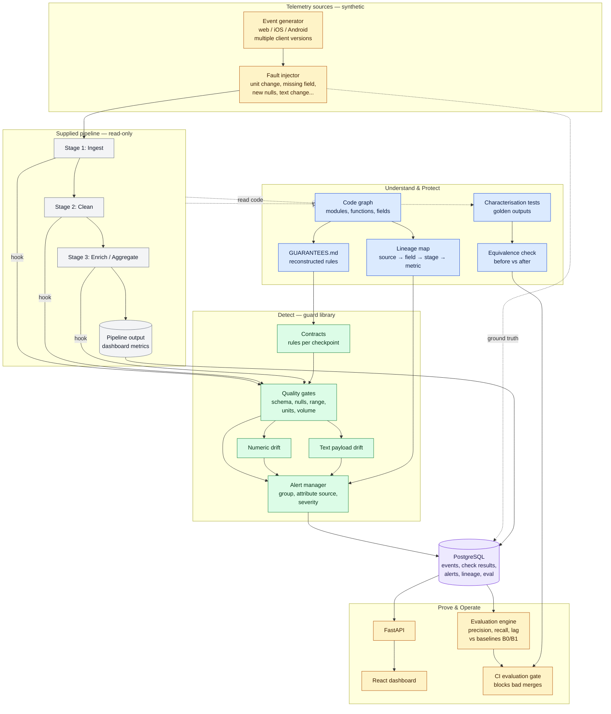
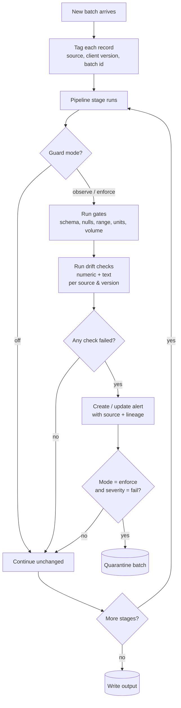
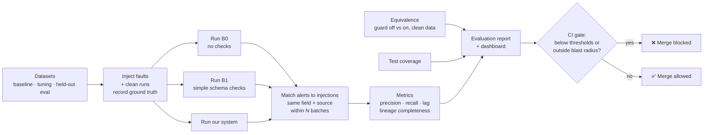
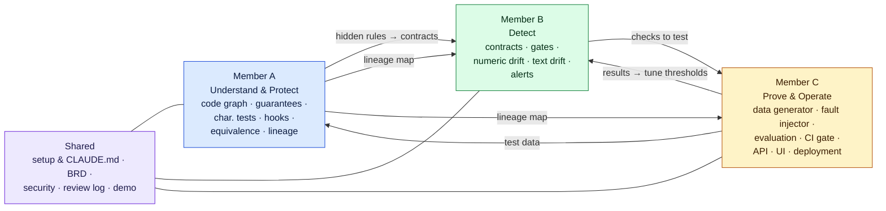

# System Diagrams: Telemetry Pipeline Hardening

> DRAFT. Reflects the current design; the pipeline source (Q1/Q2) is still open.
> Colours show the owner: **A** Understand & Protect · **B** Detect · **C** Prove & Operate · **Shared**.

## 1. Overall system architecture

## 2. What happens to one batch at runtime

## 3. Evaluation & CI gate flow

## 4. Team ownership and hand-offs

