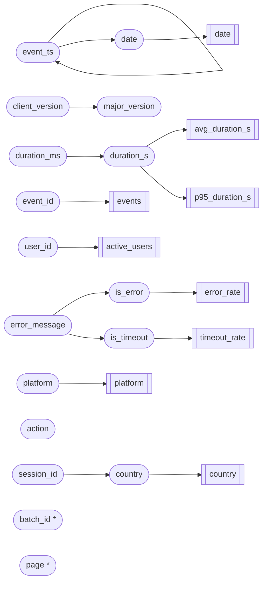

# Code graph: web_analytics

> Generated by `python -m teleguard.workflow`. Static analysis plus one confirmation run.
> **Findings are candidates, not facts.** A human confirms each one before it becomes a
> guarantee (see GUARANTEES.md).

## Summary
17 fields, 5 functions, 1 modules, 9 outputs, 4 stages · 53 edges ·
15 findings

## Stages (from the entry function)
ingest -> clean -> enrich -> aggregate

## Proposed checkpoints
| Checkpoint | Location | Attach |
|---|---|---|
| after_ingest | `run.py:106` | in_process_hook |
| after_clean | `run.py:107` | in_process_hook |
| after_enrich | `run.py:108` | in_process_hook |
| after_aggregate | `run.py:109` | in_process_hook |

## Runtime confirmation
- Fields in the code confirmed by the run: **15 of 15** (100%)
- Field-to-field links confirmed: **7 of 7** (100%)
- Columns seen only at runtime (marked `*` in the diagram): batch_id, page
- Fields in the code never seen running: none

## Data flow

## Findings (candidate hidden rules)
| # | Kind | Field | What the code implies | Evidence |
|---|---|---|---|---|
| 1 | runtime_columns | - | a DataFrame is built from records: its column names come from the data, not the code; confirm them with a runtime run | `run.py:38` |
| 2 | timestamp_unit | event_ts | 'event_ts' is parsed as epoch time in 'ms' | `run.py:39` |
| 3 | dedup_key | event_id | rows with the same 'event_id' are treated as duplicates; later copies are dropped | `run.py:47` |
| 4 | required_field | user_id | rows with missing 'user_id' are removed: 'user_id' is treated as required | `run.py:50` |
| 5 | unit_conversion | duration_ms | 'duration_s' = df['duration_ms'] / 1000.0: assumes 'duration_ms' is in the unit that this factor (1000.0) converts from | `run.py:53` |
| 6 | row_filter | duration_s | 'df' keeps only rows where df['duration_s'] < 300; other rows are dropped silently | `run.py:56` |
| 7 | keyword_match | error_message | 'error_message' is classified by matching the text 'timeout': wording or language changes break it | `run.py:60` |
| 8 | string_format | client_version | 'client_version' is assumed to be text split by '.' | `run.py:63` |
| 9 | default_fill | session_id | missing values derived from 'session_id' are silently replaced with 'Other' | `run.py:79` |
| 10 | unmapped_to_null | session_id | 'session_id' is mapped with a fixed table of 5 values (session_001, session_002, session_003, session_004, session_005); any other value becomes missing | `run.py:79` |
| 11 | row_filter | action | 'page_views' keeps only rows where df['action'] == 'page_view'; other rows are dropped silently | `run.py:90` |
| 12 | group_key_drops_nulls | date | grouped by 'date' with pandas' default dropna=True: rows with missing 'date' vanish from the result | `run.py:92` |
| 13 | group_key_drops_nulls | platform | grouped by 'platform' with pandas' default dropna=True: rows with missing 'platform' vanish from the result | `run.py:92` |
| 14 | group_key_drops_nulls | country | grouped by 'country' with pandas' default dropna=True: rows with missing 'country' vanish from the result | `run.py:92` |
| 15 | unused_field | major_version | 'major_version' is created but never used later and never reaches an output | `run.py:63` |
